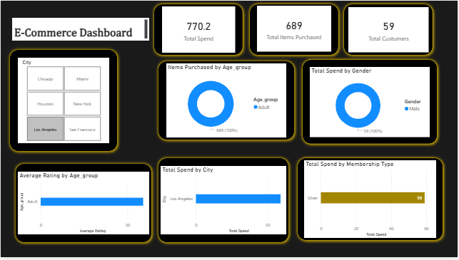

#  E-commerce Customer Behavior — Power BI Dashboard

##  Aperçu du dashboard

---

Ce projet présente une analyse du comportement d’achat de clients e-commerce, réalisée à l’aide de Power BI à partir d’un dataset issu de Kaggle.

---

##  Objectif du projet

L’objectif était simple : partir de données brutes et en tirer des insights utiles pour comprendre les clients et orienter des décisions business.

À travers ce projet, j’ai cherché à répondre à plusieurs questions :
- Qui sont les clients ?
- Comment consomment-ils ?
- Quels sont les leviers d’amélioration côté business ?

---

## 🗂️ Dataset

- **Source** : Kaggle — *E-commerce Customer Behavior – Sheet1*  
- **Nombre de clients** : 58  
- **Particularité** : dataset déjà filtré avant utilisation  

### Variables principales :
- City  
- Gender  
- Age  
- Membership Type  
- Items Purchased  
- Total Spend  
- Average Rating  

---

##  Préparation des données

Avant de construire le dashboard, j’ai effectué plusieurs étapes de préparation :

- Nettoyage et vérification des données  
- Harmonisation des catégories  
- Correction des types de données  

### ➕ Enrichissement

J’ai également créé une colonne **Age_group** directement dans Power BI afin de faciliter l’analyse :

- 18–35 → *Young Adult*  
- 36–55 → *Adult*  
- 56+ → *Senior*  

###  Mesures utilisées

- Total Spend  
- Total Items Purchased  
- Average Rating  

---

##  Dashboard Power BI

Le dashboard est construit autour de trois axes :

###  Profil client
- Répartition par genre  
- Segmentation par âge  
- Type de membership  

### 🛒 Comportement d’achat
- Volume d’articles achetés  
- Niveau de dépense  
- Intensité d’achat  

###  Performance
- Analyse par ville  
- Satisfaction client  
- Vue globale de l’activité  

---

##  Analyse & Insights

###  Une clientèle très homogène

Les données montrent un profil assez marqué :

- Environ 82 % de femmes  
- 100 % dans la catégorie *Adult*  
- 100 % membres *Silver*  

 On est face à un segment très spécifique, avec un comportement relativement cohérent.

---

### 🛍️ Un bon niveau d’engagement

- **675 articles achetés**  
- **660,3 de dépenses totales**

Malgré un statut *Silver*, les clients sont actifs et réguliers dans leurs achats.

 Cela peut indiquer un potentiel intéressant en termes de montée en gamme.

---

###  Une activité concentrée

Même si plusieurs villes existent dans le dataset, les données analysées montrent une activité concentrée sur **Miami**.

 Cela s’explique par le fait que le dataset utilisé est déjà filtré.

---

### ⭐ Satisfaction client

Les ratings disponibles indiquent une satisfaction globalement positive.

 C’est un bon signal pour travailler sur la fidélisation.

---

##  Lecture business

Ce projet met en évidence un point intéressant :

Un segment client engagé, mais sous-exploité.

Concrètement :
- Les clients dépensent et achètent régulièrement  
- Mais ils restent sur une offre *Silver*  

---

##  Recommandations

### 1. Travailler la montée en gamme
- Proposer des offres **Gold / Premium**  
- Mettre en place des avantages exclusifs  

### 2. Mieux exploiter le segment existant
- Personnalisation des campagnes marketing  
- Recommandations produits ciblées  

---

##  Limites du projet

- Dataset déjà filtré  
- Taille réduite (58 clients)  

---

